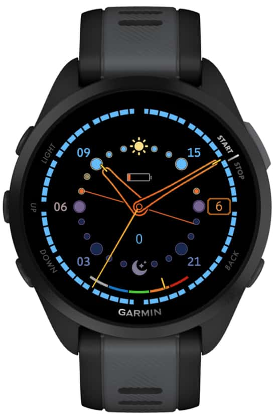

# Solargraph Garmin watch face

NOTE: currently this is only for Forerunner 165, as that's the actual device
I have. I will add other devices once I have the time to test and adjust things
for them and their various screen sizes.

A colourful watchface for Garmin smartwatches that uses a 24-hour dial and can
show sunrise and sunset times. The outer minutes/seconds ring is coloured based
on the approximate sky colour, based on sunrise/sunset time.

A few things can be toggled on/off:

* Date window
* Battery icon
* Heartrate dial
* Step count
* Sunrise/sunset lines
